# Fleet Agent

An AI agent answers questions about a synthetic B2B vehicle fleet by writing SQL against
Databricks Unity Catalog, running on Microsoft Foundry.

**The published artefact is not the agent. It is the agent's evaluation.**

### → [javoo-bot.github.io/foundry-agent](https://javoo-bot.github.io/foundry-agent/)

 

## How it is wired

 

## What it scores

Runs have landed between **27 and 31 of 32**, with nothing changed between some of them but
the sampling. Arithmetic (20/20) and refusals (6/6) hold steady; the variance lives entirely
in *questions the data cannot answer*, which ranges 3/6 to 5/6.

A single number is not the result. The spread is, and so is which categories move.

 

---

Synthetic data throughout — no real vehicle, customer or warranty claim is represented,
and nothing derives from a Volkswagen dataset. Built by
[Javier Lobato](https://www.linkedin.com/in/javier-lobato-menendez/).
